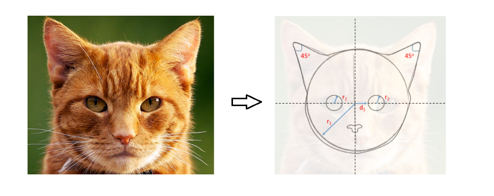

The field of computer vision has made great strides over the last two decades, with significant contributions from deep learning techniques during the last five years. Today, as self-driving cars that perform complex, real-time visual recognition tasks are within technological reach, let's take a look at the most fundamental vision task - that of classification. In this post, we will classify Devanagari vowels using TFLearn, a deep learning framework built on top of TensorFlow.

<!--more-->

## What is classification ?

The simplest vision task of classification consists of identifying correctly which one of a set of pre-defined categories an image belongs to.

For example, let's say that we're dealing with images that are guaranted to fall into one of these three categories - {cats,dogs,horses}. That is, any image in our posession is compulsorily either the image of a cat, or the image of a dog , or the image of a horse. The task is to go over these images, and place each image in its correct category. In other words, a cat should be correctly idenified as a cat, and not a dog or a horse.

Of course, this is something human beings do trivially. However, as we attempt to create artifical intelligence to perform the same task, we begin to wonder - how do we write an algorithm to do this? What really makes a cat a cat? 

## Why is it hard ?

Let us for a moment entertain the thought of telling a computer *exactly* what a cat is.

&nbsp;

We may come up with an algorithm as follows:

+ if there is a circle of radius $r1$
            **AND**
+ if there are two smaller circles of radii $r2$, at a distance $d1$ from the origin
            **AND**
+ if there are two small triangles pointing in the NE and NW directions measuring 45 degrees each 
            **AND**
+ so on and so forth ...
            **THEN**
+ the image is a that of a cat! 

We then proceed to test our algorithm on a random cat image.

Since all conditions are seemingly met, we succesfully classify the image as that of a cat. Fantastic!

But wait, what about these cats ?

If that was not enough to break our model, what about these ?

We begin to realize that all cats need not be posing for passport-style photographs like how we had imagined. Even something as simple as a cat presents an infinite number of variations!     
It is clearly *impossible* to code up shapes, sizes and orientations for all cats in the world.  
Also, there are an infinite number of objects in the world!

On the contrary, a human being can trivially identify all of the above images as cats, even in images where only a small part of the cat is shown (like the cat hiding behind a tree). What is amazing is that we can identify cats in configurations we have never seen before, simply because we have *learnt* what a cat is, and we can always identify it succesfully regardless of what it's doing.   
So what is it exactly that our brains *learn* about a cat? How is the representation of a cat stored/programmed in our brains? 

## The world of pixels

While the answer to that question is something that neuroscientists are still figuring out, for a computer, an image is nothing but an array of pixel values.
Let's look at a sample of numbers from the classic [MNIST](http://yann.lecun.com/exdb/mnist/) database, which is a collection of 60,000 grayscale images of handwritten digits 0-9.

Each image has a resolution of 28 pixels x 28 pixels. In a grayscale representation **0** represents a pure black, **255** represents pure white, and all integers in between represent various shades of gray. Thus to a computer, each MNIST image is a 28x28 **matrix of pixel intensity values**.  

For example, in the image of the "1", since most of the empty space is white pixels, most of its matrix values will be 255. The few pixels along the middle that mark the "1" will have values close to zero. (Some people reverse this convention of 0 and 255)

A color image, on the other hand, may follow the popular RGB scheme where there are 3 channels - one for each of red, green and blue. This just means that instead of one matrix, there are now three matrices of pixel values that define the image.

So rather than focus on the question "What makes a cat *a cat*?", let's simplify it to a grayscale, 1-D question - "What makes a **'1'** a **'1'**" ?

The answer is - the right pixel values in the right positions!  
Though seemingly obvious and simple, it's an insightful and powerful idea.

What we're saying is -  all that is there to a '1' is basically a few black pixels at the center in a thin, vertical strip amongst a sea of white pixels. This is true!  
Any change to this pattern will very likely result in the image *not* being a '1'. 

Of course, different people write '1' in different ways, but all of them largely follow the above mentioned pattern. No one writes a '1' like an '8' (which would heavily alter the pixel distribution). Some people may write '1' a bit like how they write '7', but with a sufficient number of unambiguous examples, each digit can be classified correctly. 

## Classifying Devanagari vowels

Armed with all this background information, let's get to work!

We will be using a 2-layer feed forward neural network to classifiy devanagari vowels.
The diagram below shows only connections from one node for simplicity, but in reality it is a fully connected network with every node connecting to every other node of its adjacent layer.

A network like the one shown above is more than sufficient to classify grayscale images of digits,letters and other simple representations. The task here is greatly simplified because unlike cats:
1. These are grayscale images.
2. These typically don't offer infinite variations, and most letters are actually in the center of the picture, always facing the viewer 

There are dedicated neural networks architecture used almost exclusively for classifying multi-channel color images (like cats) that can present a myriad possibilites, called [convolutional neural networks](https://en.wikipedia.org/wiki/Convolutional_neural_network). In this post we will just stick to a regular neural network as shown above.

For implementation, we will be using a high-level library called [TFLearn](http://tflearn.org/) built on top of [Tensorflow](https://www.tensorflow.org/). 

The vowels are taken from the [Devanagari character dataset](https://www.kaggle.com/ashokpant/devanagari-character-dataset/version/1). Good quality, Indian language datasets are either non-existent or hard to come by; so special thanks to researchers from Nepal for uploading this dataset on Kaggle!

## Implementation and Training

The images in this dataset are 36 pixels x 36 pixels. This is the reason we have 1296 neurons in the input layer.  
There are 12 output neurons, since we are trying to classify 12 distinct vowels. (The dataset doesn't contain ऋ and ॠ )

<pre class="brush: python">
# Load the dataset and get the output classes
dataset = 'nhcd_small_vowels/'
vowel_dirs = os.listdir(dataset)
classes = [vowel for vowel in vowel_dirs if os.path.isdir(dataset + vowel)]

# Print classes. The twelve vowels.
classes
</pre>

    ['01_a',
     '02_aa',
     '03_e',
     '04_ee',
     '05_u',
     '06_uu',
     '07_ae',
     '08_ai',
     '09_o',
     '10_au',
     '11_am',
     '12_ah']

&nbsp;

Let's look at a couple of example vowels and their pixel intensity matrices.

Let's now build the neural network as discussed above.  
The hidden layer size is set to 400 and the learning rate to 0.1

<pre class="brush: python">
def dev_vow_classifier():

    tf.reset_default_graph()
    
    #Build the three layers of the network
    neural_network = tflearn.input_data([None, 1296])
    neural_network = tflearn.fully_connected(neural_network, 400, activation='ReLU')
    neural_network = tflearn.fully_connected(neural_network, 12, activation='softmax')
    
    #Specify the training mechanism
    neural_network = tflearn.regression(neural_network,optimizer='sgd',learning_rate=0.1,\
    							loss='categorical_crossentropy')
    full_nn = tflearn.DNN(neural_network)
    return full_nn
</pre>

<pre class="brush: python">
# Instantiate the neural network
dvc = dev_vow_classifier()
</pre>

&nbsp;
As always, there are two stages involved:  

1: **Training**
 - There are 221 images per class.
 - For each image, 'flatten' the pixel matrix and feed the 1296 pixel values into the input layer.
 - Randomly initialize weights.
 - Set '1' on the appropriate output neuron class and '0' on the remaining 11 output neurons.
 - For example, if the image is that of an 'इ', set the 3rd output neruon to '1' and the rest to '0'.
 - Perform forward and backward propagation to learn the values of weights using [gradient descent](https://jayanand90.github.io/An-introduction-to-gradient-descent/).    

2:  **Testing**
 - Run the neural network on previously unseen vowels (set aside initially)
 - Report test accuracy

## Results

The following steps train and test the model, and the testing accuracy is reported at the end.

<pre class="brush: python">
# Training - trainX and trainY are training input data  and labels respectively
dvc.fit(trainX, trainY, validation_set=0.1, show_metric=True, batch_size=5, n_epoch=20)

#Testing - testX and testY are test input data and actual labels respectively
predictions = np.array(dvc.predict(testX)).argmax(axis=1)
real_labels = testY.argmax(axis=1)
test_accuracy = np.mean(predictions == real_labels, axis=0)

print("Test accuracy: ", test_accuracy)
</pre>

    Test accuracy:  0.87969924812

The neural network manages to get an accuracy of **~88%**.  

Let's look at some of the correct predictions.

The neural network classifies the first and third pictures correctly with absolute confidence. (the x-axis represents confidence %)
The second picture is also classified correctly, although only with ~75% confidence. The network thinks that there is a small chance that the vowel is an ए (~22%) or  आ (~3%), due to the way pixels are arranged in this particular picture.

Now, an 88% accuracy also means that we're classifying about 12 out of every 100 test images *incorrectly*.

The next natural question is - What images are we classifying incorrectly, and why? Is there any way to improve the model ?

## Analysis

Here are a couple of images that are classified *incorrectly*.

On looking closely, we can see why the network may have gotten confused while classifying the above images.  
In the first image, which is intended to be 'अः', the two dots (*visarga*) at the right aren't properly visible; in fact, one dot is completely missing from the picture. This causes the network to think that the image is more likely an अ , as evinced by the predicition chart on the right.
Similarly, in the second picture, because of the curve on the right, the network thinks that the image is more likely an ऊ.

So what can we do to help the network classify better?

## Data augmentation

The dataset is quite small, having only 221 images per vowel.   
It would be nice if we had more samples, so that the neural network can learn better from many **more varieties** of the twelve vowels.

One way to artifically inflate the dataset is by using a technique called data augmentation.

This would require us to artifically introduce *transformations* to our dataset, so that we have more sample images to train on.  
There are many ways to do this - here will consider a few basic ones - **rotation**, **distortion**, and **translation**.

The transformations shown above are applied to each image in the dataset. This results in inflating the dataset to **5x** its original size!
It makes sense to do these transformations because:
1. In reality, it is entirely possible that handwritten letters are imperfect; everybody ends up shifting, distorting or tilting characters while writing.
2. In spite of these transformations, our brains effortlessly recognize these letters - so why not train the neural network to do so too ?

Now that we have a lot many more example to learn from , let's again train and test our neural network

<pre class="brush: python">
# Training with augmented dataset while retaining other settings
dvc.fit(trainX, trainY, validation_set=0.1, show_metric=True, batch_size=5, n_epoch=20)

#Testing 
predictions = np.array(dvc.predict(testX)).argmax(axis=1)
real_labels = testY.argmax(axis=1)
test_accuracy = np.mean(predictions == real_labels, axis=0)

print("Test accuracy: ", test_accuracy)
</pre>

    Test accuracy:  0.920226130653

As seen above, the test accuracy improves to 92%, meaning that data augmentation proved useful.

## Conclusions

State-of-the-art computer vision techniques achieve much more than classification. Scene recogntion, object identification and labeling, video understanding are some areas that have seen tremendous improvement over the last few years. However, classification is the basic foundation over which these advanced techniques are built. Hope this post covered some ground in this regard and on how deep learning applies to classifcation tasks! 

## [References](https://github.com/jayanand90/jayanand90.github.io/blob/master/images/devanagari_classification/references.txt)

<link rel="stylesheet" type="text/css" href="{{ site.baseurl }}/css/shCore.css">
<link rel="stylesheet" type="text/css" href="{{ site.baseurl }}/css/shThemeDefault.css">

<script type="text/javascript">
	// SyntaxHighlighter.config.bloggerMode = true;
	SyntaxHighlighter.config.toolbar = true;
    SyntaxHighlighter.all();
