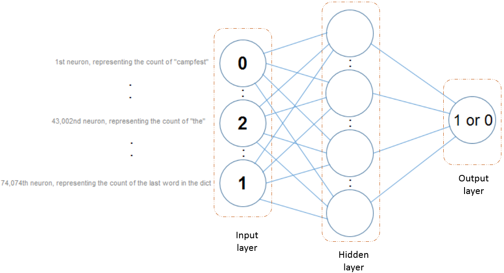
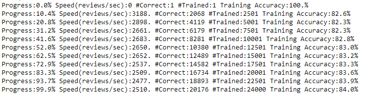
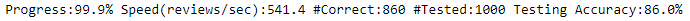
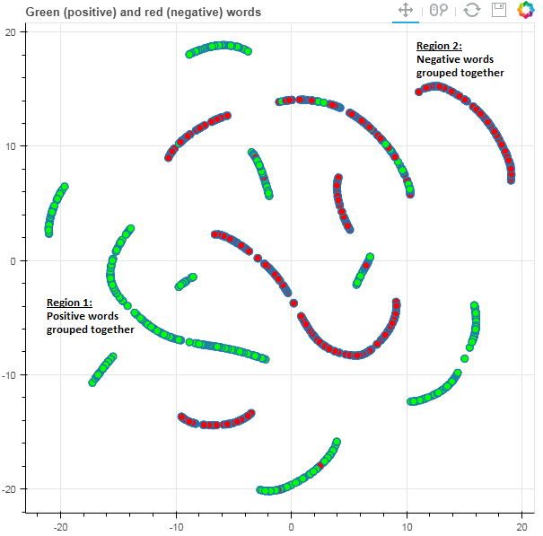
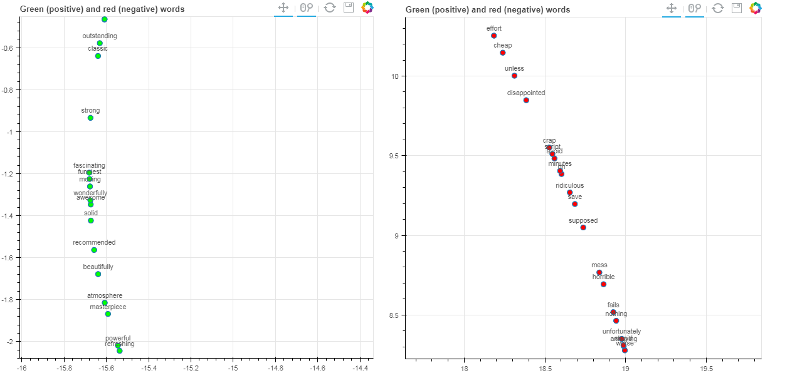

One of the many things our brains do very well during language processing, is the task of abstracting out details, keeping only information that is relevant, and then proceeding to form a quick summary. For example, we could read a sizable paragraph of text (like an article), and come up with a one-line summary or a heading that best describes it. 

<!--more-->

Many times, we can also gauge the underlying mood that a passage of text conveys. For example, upon reading a product review on Amazon or eBay, we get an idea of whether the buyer was "happy", "angry", "disappointed" or something else. After reading a movie review, we know broadly whether the movie is "good" or "bad". Our brains are naturally adept at extracting "emotion" from mere text, which necessitates the following question: Can a computer do it ?  Given text (be it a single line or several pages), can a machine capture the emotion or sentiment that the text conveys ?     

This is the fundamental question that Sentiment Analysis attempts to answer. It is an area of study that falls under the wider field of  [NLP](https://en.wikipedia.org/wiki/Natural_language_processing).

In this post, we will attempt to address this question using movie reviews as an example.

## Why is it hard ?

Let's take a more detailed look at the problem, starting with one movie review. Let's assume for simplicity that there are only two classes of sentiments - positive (good) and negative (bad). The task is to process the review and label it as either "positive" or "negative".

At the outset, it does not seem like a very difficult task. We could pick a list of "positive" words likely to be found in reviews, such as "good", "amazing", "excellent" etc,  and search the review for these words. Assuming the reviewer used some of these words, we can simply flag the review as "positive" if one or more of these words are found in the review, and perhaps follow a similar approach for "negative" words to flag a review as negative. Sounds straightforward, right ?

Indeed, the above method would work very well for the following reviews:

1. "The movie was **great**! A **must-watch**"
2. "...A **solid** storyline that makes a **strong** impact on the viewers"
3. "One of the **worst** movies ever. Do not **waste** your time"

The first and the second reviews would be flagged positive, while the third would be flagged negative.

With small modifications, the same reviews pose a non-trivial challenge:

1. The movie was absolutely not **great**. Anyone who says it is a **must-watch** is lying"
2. "..due to the absence of a **solid** storyline, there is hardly a **strong** impact on the viewers"
3. "After making one of the **worst** movies ever, the director makes a sensational comeback. The movie gets into the thick of action within the first ten minutes without **wasting** your time"

As you can guess, our model will very likely fail when it encounters reviews like the ones above. There is far more subtlety to reviews than just a list of positive and negative words. Many things have to be dealt with - the sequence in which words appear, negations, double negations, sarcasm, ambiguity - and much more.

Clearly, it is not a great idea to code up condition after condition into our model. There must be a better way of solving with this problem.

## What do we do ?

Like most other problems in machine learning, the answer is - don't bother coming up with curated lists of positive/negative words; let the algorithm decide what to do!

There are multiple ways to approach the problem, with varying degrees of complexity. Simpler approaches rely on counts of words, while completely disregarding the order or sequence in which words appear. More complex approaches take sequence into consideration, thus requiring some sort of "memory" of words previously encountered.

In this post, we shall go over a count/frequency based approach, without taking sequence into consideration. 

## The Dataset

We will be using the [Large Movie Review Dataset](http://ai.stanford.edu/~amaas/data/sentiment/), which contains a collection of 25,000 IMDB movie reviews, along with their labels (positive or negative).

Just to remind ourselves, there are primarily two phases involved in any machine learning approach - **training** and **testing**.   
Training is when we feed our model what we know to be true; in this case, reviews and their labels (positive or negative). The model *learns* from large quantities of training data, what constitutes a good review and what constitutes a bad review. It is then ready for testing - meaning, to predict the sentiment of a new, previously unseen set of reviews, which is known as the test data.   

We will use the first 24,000 reviews (along with their labels) for training, and reserve the last 1000 reviews for testing. 

## Let's begin!

<pre class="brush: python">
fr = open('reviews.txt','r')
reviews = list(map(lambda a:a[:-1],fr.readlines()))
fr.close()
</pre>

<pre class="brush: python">
fl = open('labels.txt','r')
labels = list(map(lambda a:a[:-1],fl.readlines()))
fl.close()
</pre>

Let's take a look at some reviews and their labels to get a feel for the data.

------------

<pre class="brush: python">
## The first review
reviews[0]
</pre>

    'bromwell high is a cartoon comedy . it ran at the same time as some other programs about school life  such as  teachers  . my   years in the teaching profession lead me to believe that bromwell high  s satire is much closer to reality than is  teachers  . the scramble to survive financially  the insightful students who can see right through their pathetic teachers  pomp  the pettiness of the whole situation  all remind me of the schools i knew and their students . when i saw the episode in which a student repeatedly tried to burn down the school  i immediately recalled . . . . . . . . . at . . . . . . . . . . high . a classic line inspector i  m here to sack one of your teachers . student welcome to bromwell high . i expect that many adults of my age think that bromwell high is far fetched . what a pity that it isn  t   '

<pre class="brush: python">
## The label associated with the first review
labels[0]
</pre>

    'positive'

--------------------

<pre class="brush: python">
# The 64th review - that of the hindi movie Tashan!
reviews[77] 
</pre>

    'if there is one film which is the worst of this year  it  s tashan the first promo gave an indication that the film will be a boring dhoom  style film  and well i knew first only it would be a bad film whatever it maybe because of it being a yashraj film or maybe seeing the cheesy promo but this film gave me a shock  it was even worst then dhoom  and what i expected first saif  s introduction which is boring then saif  kareena meet  kareena is so artificial and then anil kapoor oh god  what he is doing in such a weird film  what kinda role it is  what acting is he doing  his first scene is alright but then his act gets repetitive and he overacts then came akshay who provided some nice scenes  but then the film became more boring and with all the outdated stuff childhood romance  overdose of childish rajnikant style action scenes and all boring scenes the ending is another joke  br    br   vijay krishna acharya would have got  films more to direct  if this film had worked  thats the strategy of yashraj  only money nothing else so vijay is another addition to their list of crap filmmakers music  vishal shekhar  is ordinary  br    br   performances akshay kumar comes in the film as a whiff of fresh air  he actually provides some engaging moments saif ali khan is irritating  kareena is equally bad anil kapoor hams outrageously and spoils the show even more rest are okay  '

<pre class="brush: python">
labels[77] # Not surprisingly..
</pre>

    'negative'

--------------------

## Encoding reviews

We can encode reviews using the [bag-of-words](https://en.wikipedia.org/wiki/Bag-of-words_model#Example_implementation) model.   
Basically this involves the following steps:
    1. Find out the number of unique words across all reviews. (say there are 'n')
    2. Create a dictionary/look-up table so that each unique word is indexed by a unique number.
    3. Transform each review into a feature vector of length n, based on the counts of words appearing in the review. 
    
The example given in the above article illustrates these 3 steps well.

### Step 1 - Find number of unique words across all reviews
<pre class="brush: python">
from collections import Counter
total_counts = Counter()
for i in range(len(reviews)):
    rv = reviews[i]
    sp_rv = rv.split(' ')
    for word in sp_rv:
        total_counts[word] += 1
</pre>

<pre class="brush: python">
len(total_counts)
</pre>

    74074

There are 74,074 unique words in our dataset. We will represent each review using a feature vector of this length, regardless of the size of the review, using the bag-of-words model.

&nbsp;

### Step 2 - Create a dictionary/look-up table for each of these 74074 words
<pre class="brush: python">
word2index = {}
for i,word in enumerate(set(total_counts)):
    word2index[word] = i
</pre>

The output is the following:

    {'': 0,
     'campfest': 1,
     'coffie': 2,
     'synch': 3,
     'migrs': 4,
     'chrysler': 5,
     'frameworks': 6,
     ..
     ..
     }

&nbsp;

### Step 3
Transform each review into a fixed-length feature vector using the dictionary created in step 2

Using a one-line review as an example -  "The movie is the best in recent times" - simply update the placeholder indices for these words with their counts. That is, if the lookup value for *movie* is 10, *the* is 43,002, then the feature vector for this movie would like:

#### [0 0 0 ... 1 ......  2  .....]

The first few elements are zeros since this particular one-line review doesn't contain the words "campfest", "coffie" etc. Since the word "movie" appears once, the 10th element is marked "1". Since the word "the" occurs twice, the 43,002nd element is marked "2", and so on and so forth.

## Training

The model we will discuss here is a two layer neural network. (excluding the input).

The input layer contains 74,074 units as discussed before.  
The hidden layer is chosen to have a size of 10.  
The output layer has just one unit, predicting 0 for a negative review and 1 for a positive review.

Reviews and labels from the training set (24,000 entries) are fed in one-by-one during forward propagation. The weights (connections between layers) are initialized randomly, with values being drawn from a normal distribution having a mean of zero. As the model trains during backpropagation, the weights continuously keep getting updated using [gradient descent](https://jayanand90.github.io/An-introduction-to-gradient-descent/). 

## Results

Once the neural network has learnt its parameters (weights), it's time to test the accuracy of our model!
Testing is almost instantaneous; it is training that can take several hours or even weeks, depending on the size of the dataset.

With a very simple model and without spending much effort to fine-tune the model, a testing accuracy of 86% was obtained. The learning rate used was 0.1.

There is ample scope of improvement; many steps can be optimized further to yield better results. For instance, the most commonly appearing words in reviews are going to be "the", "a", "of" etc, regardless of whether labels are positive or negative. These words therefore add no value with regard to sentiment classification and can be consequenctly removed during training to improve accuracy.

<pre class="brush: python">
## The 10 most common words across all reviews.

total_counts.most_common(10)
</pre>

    [('', 1111930),
     ('the', 336713),
     ('.', 327192),
     ('and', 164107),
     ('a', 163009),
     ('of', 145864),
     ('to', 135720),
     ('is', 107328),
     ('br', 101872),
     ('it', 96352)]

Let us now take a look at what the network has actually learnt.   
The following figure shows that the network has grouped together words it deems to be similar in context.
Green dots indicate positive words and red dots negative.

On zooming into two specific, highly polar regions marked in the above figure, we see what kind of words are being treated similarly by the network. 

In the positive graph, we can see words like "fascinating", "wonderfully", "awesome", "masterpiece" and the like. The network has ascertained that these words carry a positive sentiment with roughly the same weightage. Similarly, in the negative graph, words that convey negative sentiment such as "disappointed", "ridiculous" and "cheap" can be observed. 

## Conclusions

While this post dealt with a binary sentiment prediction, a similar approach can very well be followed for a multi-class prediction, such as predicting a star rating out of 5 for a movie or a product. Advances in the field of NLP have resulted in widespread use of sentiment anaylsis in many fields where there is some sort of user feedback, such as customer surveys, social media online shopping etc, where sentiment is mined from text to drive product improvement and marketing techniques such as recommender systems.

<link rel="stylesheet" type="text/css" href="{{ site.baseurl }}/css/shCore.css">
<link rel="stylesheet" type="text/css" href="{{ site.baseurl }}/css/shThemeDefault.css">

<script type="text/javascript">
	// SyntaxHighlighter.config.bloggerMode = true;
	SyntaxHighlighter.config.toolbar = true;
    SyntaxHighlighter.all();
